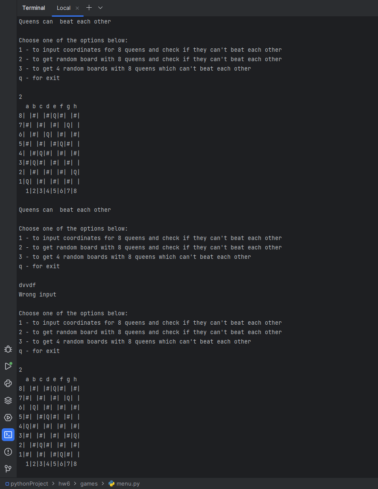

1. Создайте модуль и напишите в нём функцию, которая получает на вход дату в формате DD.MM.YYYY Функция возвращает 
истину, если дата может существовать или ложь, если такая дата невозможна. Для простоты договоримся, что год может 
быть в диапазоне [1, 9999]. Весь период (1 января 1 года - 31 декабря 9999 года) действует Григорианский календарь. 
Проверку года на високосность вынести в отдельную защищённую функцию.

    [task_1](https://github.com/VeraNik1/pythonProject-HW1/tree/homework6/hw6/date_package)

2. В модуль с проверкой даты добавьте возможность запуска в терминале с передачей даты на проверку.

    [task 2](https://github.com/VeraNik1/pythonProject-HW1/blob/homework6/hw6/date_package/user_mode.py)

3. Добавьте в пакет, созданный на семинаре шахматный модуль. Внутри него напишите код, решающий задачу о 8 ферзях. 
Известно, что на доске 8×8 можно расставить 8 ферзей так, чтобы они не били друг друга. Вам дана расстановка 8 ферзей 
на доске, определите, есть ли среди них пара бьющих друг друга. Программа получает на вход восемь пар чисел, каждое 
число от 1 до 8 - координаты 8 ферзей. 
Если ферзи не бьют друг друга верните истину, а если бьют - ложь.

    [task 3](https://github.com/VeraNik1/pythonProject-HW1/blob/homework6/hw6/games/chess_mod.py)
5. Напишите функцию в шахматный модуль. Используйте генератор случайных чисел для случайной расстановки ферзей в задаче 
выше. Проверяйте различный случайные варианты и выведите 4 успешных расстановки.

    [task 4](https://github.com/VeraNik1/pythonProject-HW1/blob/homework6/hw6/games/chess_mod.py)

